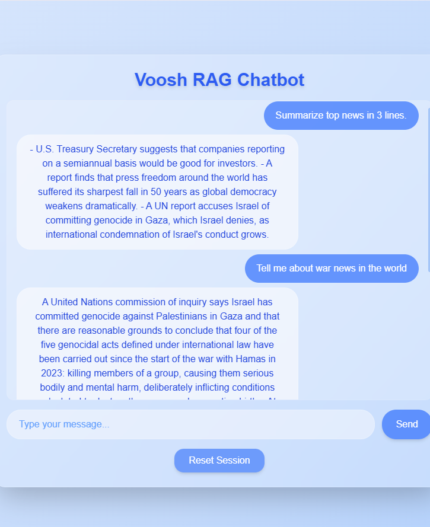

## RAG-Powered News Chatbot - Monorepo

This repository contains the complete project for the **RAG-Powered News Chatbot**, including:

- **Frontend** – React-based chat interface  
- **Backend** – Node.js + Express API with Redis and Qdrant integration  
- **Worker** – Python-based Embedding and LLM adapters  

The system follows a Retrieval-Augmented Generation (RAG) pipeline to fetch relevant news articles and generate contextual responses using a Large Language Model (LLM).

## Project Workflow 📜


---

# 1️⃣ Start Worker Services (in the background)
- **Navigate to the worker folder**
```bash
cd worker
venv\Scripts\Activate
# Read the worker README carefully.

# Start the Embedding Adapter in the background
python adapter.py 

# Start the LLM Adapter in the foreground
python llm_adapter.py
```
# 2️⃣ Start Backend (in the background)
- **Navigate to the backend folder**
```bash
cd backend

# Read the backend README for environment variable setup.

# Install dependencies and run
npm install
npm run dev
```
# 3️⃣ Start Frontend (in the foreground)
- **Navigate to the frontend folder**
```bash
cd frontend

# Read the frontend README.

# Install dependencies and run
npm install
npm run dev
```

## 📸 Chatbot Screenshot

